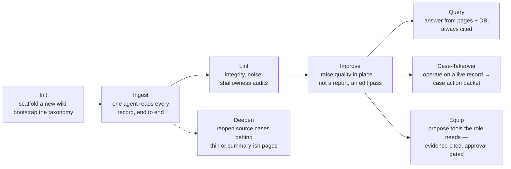
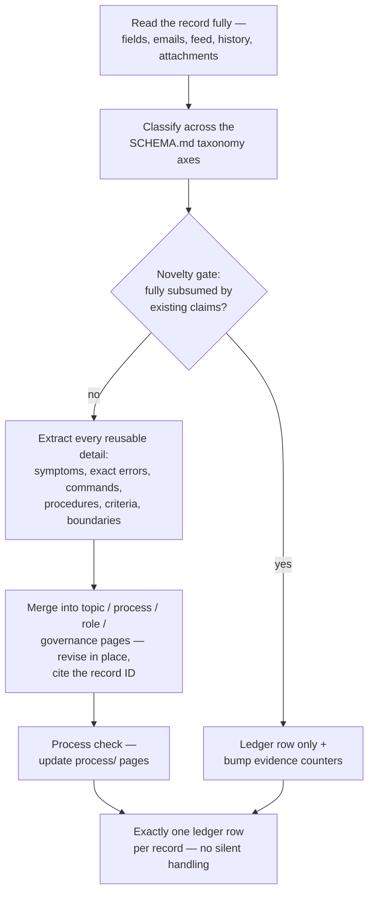
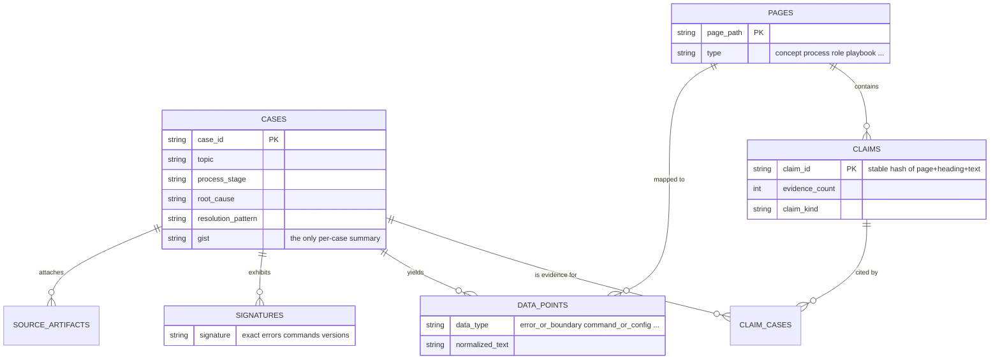
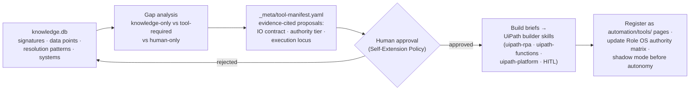

# digital-worker-grounding

A reusable agent skill that turns a **corpus of business records** — support cases, tickets, claims,
orders, transcripts, SOPs — into the **grounded knowledge and authority model of a digital worker**:
a topic-oriented wiki where every claim cites its source records, a SQLite knowledge DB for
corpus-level queries, and a **Role OS** that writes down what the worker may do, may request, must
escalate, and must never claim.

It is the design-time half of
[Maestro Worker Foundry](https://github.com/KevinBernstein-UiPath/MaestroWorkerFoundry), where a
worker trained by this skill runs as a Hermes agent orchestrated by UiPath Maestro. Current version:
**v2.3.0**.

---

## Operating modes

Eight modes: **Init**, **Ingest**, **Deepen**, **Case-Takeover**, **Query**, **Lint**, **Improve**,
**Equip** — defined in [`SKILL.md`](SKILL.md), with per-mode playbooks under [`references/`](references/).

## The ingest loop (per record)

**Hard Rules** (they override everything else in the skill — [`SKILL.md`](SKILL.md)):

1. Never create a page for a single case; per-case provenance lives in the ledger and in citations.
2. Never name pages or sections after a batch or ingest run.
3. Never write case summaries into the wiki — extract the reusable signal, cite the case ID.
4. **Depth is the deliverable** — a claim that merely names a category is forbidden; every claim
   carries actionable substance.
5. Revise pages in place; never append per-ingest sections.
6. Judge by signal-to-noise, not volume.
7. Every case gets a ledger row — processed, skipped, or failed.
8. Orient before writing (SCHEMA, index, log, topic map).
9. One agent does the ingest — no subagent delegation, no bulk classification scripts.

## The knowledge model

Provenance is **citation-based**: the source system stays the record of truth; every durable claim
carries `(evidence: N cases — e.g. ID1, ID2)` inline, and the append-only `_meta/ingest-ledger.csv`
holds exactly one row per record. Customer names, emails, phones, and credentials are sanitized out
of durable pages.

**Proof at scale:** the Maestro Worker Foundry instantiation trained 885 completed Salesforce
support cases into 102 substantive pages, 2,970 cited claims, 6,381 claim-to-case evidence links,
and 341 normalized signatures — with a first shallow pass caught by depth checks and rejected.

## Role OS — the authority layer

The wiki root carries a single governing page, `role-os.md`, generated from the
[template](references/templates.md) (17 sections): identity & mission, attention model,
**evidence-trust model**, decision model, communication model, **authority boundaries**
(*may do · may request · must escalate · must never claim*), execution & exception loops,
**self-extension policy** (what the worker may change about its own tools, and what requires human
approval), evaluation model, governance model, anti-patterns, mantra.

Because Role OS content is distilled from the corpus, even the authority boundaries carry evidence
citations.

## Equip mode — from knowledge to capability

Status honestly stated: the Equip pipeline is **specified** in
[`references/equip-mode.md`](references/equip-mode.md); a **prototype** gap analysis has run against
the real 885-case knowledge DB and generated an 11-tool manifest (every entry stamped
*“PROPOSAL — requires human approval before any build starts”*). No tool has been built yet.

## Scripts

| Script | What it does |
|---|---|
| `refresh_knowledge_db.py` | Rebuild `_meta/knowledge.db` from the wiki + ledger |
| `query_knowledge_db.py` | Generic record/claim/signature queries (CLI) |
| `evidence_audit.py` | DB integrity: orphan links, uncited claims, raw-source leakage |
| `article_quality_lint.py` | Page quality: noise, case-summary prose, thin pages, missing sections |
| `page_review.py` | Single-page review with split/expand suggestions |
| `docs_grounding_check.py` | Verify claims against official UiPath docs (`uip docsai`) |
| `promote_data_points.py` | Cluster repeated data points into candidate claims |
| `topic_discovery.py` | Surface recurring terms/signatures that lack a page |
| `extract_signatures.py` / `attachment_ingest.py` / `record_inspector.py` | Extraction & inspection helpers |

## What's implemented vs. specified vs. designed

- **Implemented (code):** the SQLite knowledge DB (7 tables, 2 views) and the 13-script tool-chain
  above.
- **Specified (agent procedure):** all eight modes' playbooks, Hard Rules, taxonomy + novelty gate,
  batch/parallel ingest protocols, Role OS template, ledger/citation discipline.
- **Design-stage:** the Equip build-handoff pipeline end-to-end (prototype gap analysis exists in
  the Foundry repo; builder-skill handoffs and tool registration are not yet wired).

The record model is domain-generic (a “case” may be any business object); the current extraction
heuristics are tuned for UiPath/Salesforce support corpora and are the expected retuning cost when
porting to a new domain.
